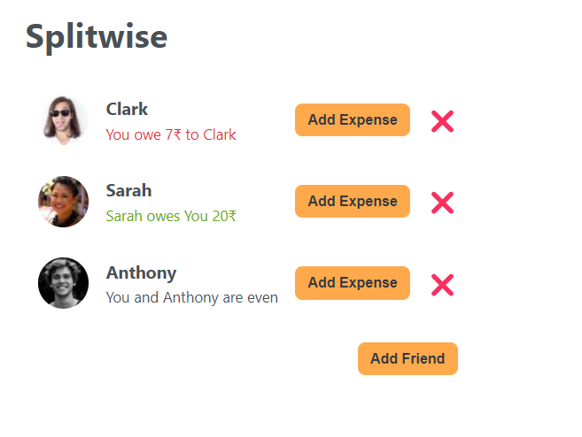

# Splitwise App

This is an interesting a very useful app, which helps you in splitting your bills with your friends.

## Features

- You can add your friends
- You can split bills with your Friends.

## How to run the project

- Download or clone the repository
- Do a `npm install` to install necessary packages
- Then run `npm run start`
- Then the project should locally at port 3000.

## After Running it should look like below image

